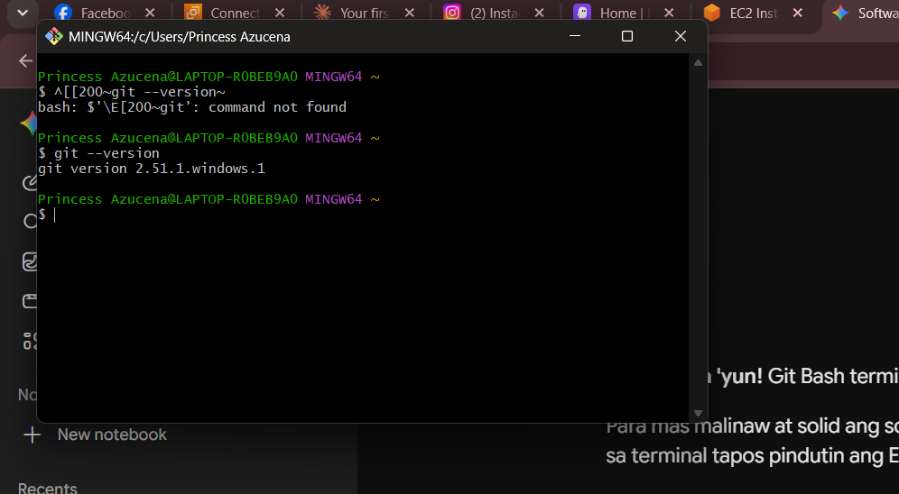
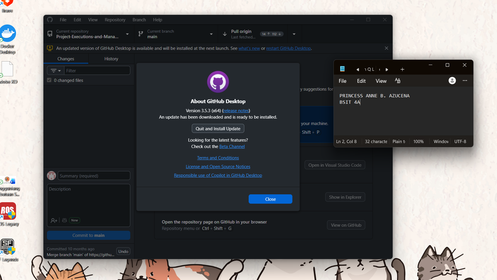
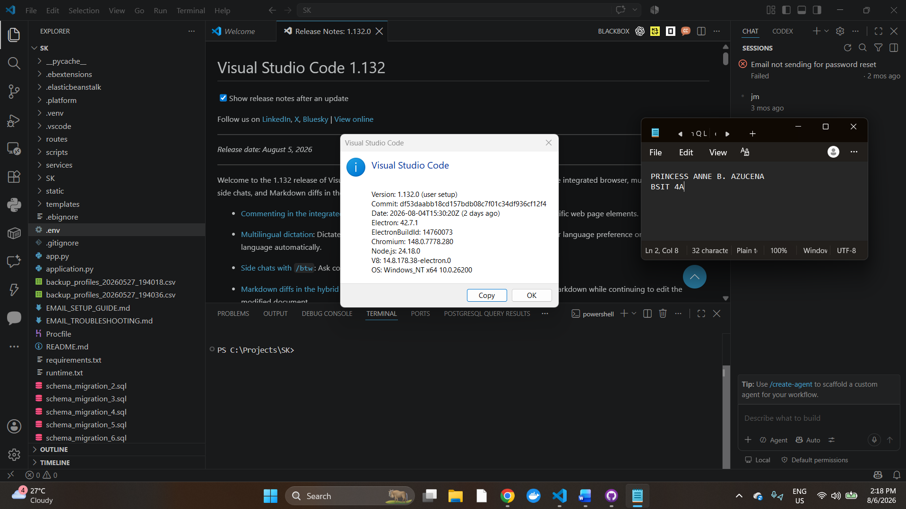
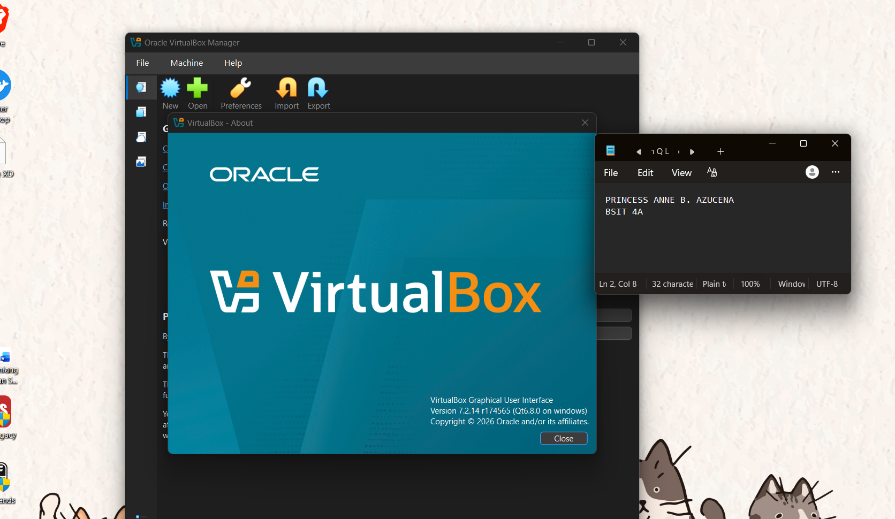
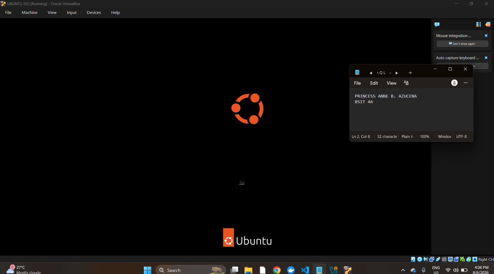
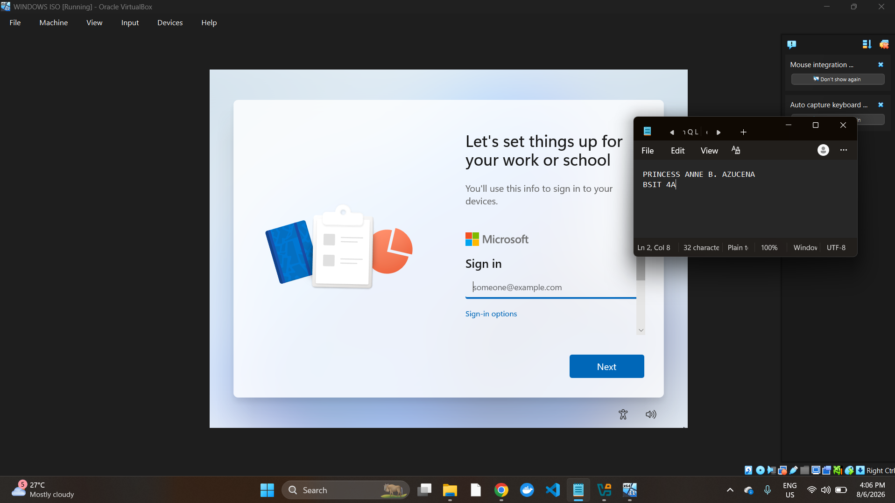
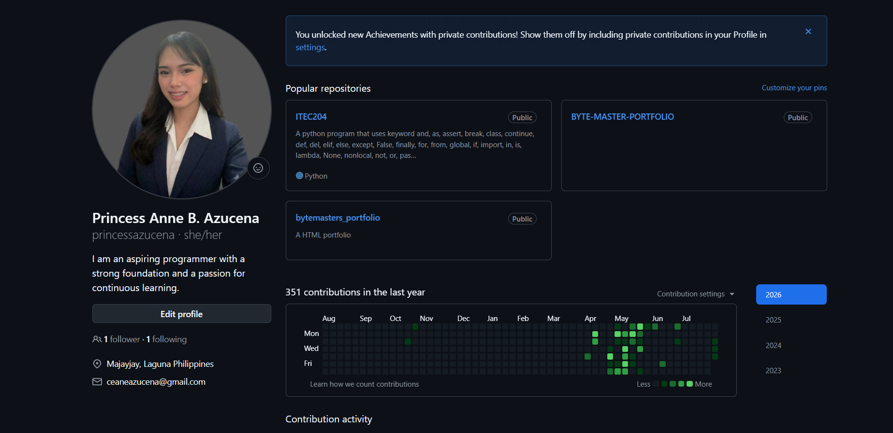
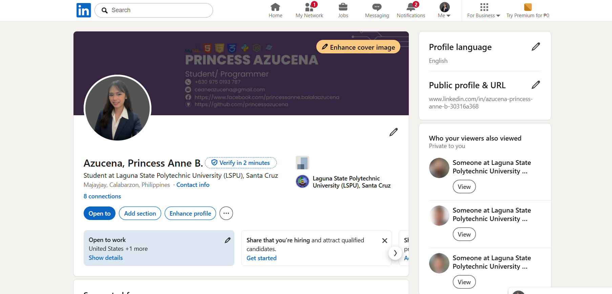
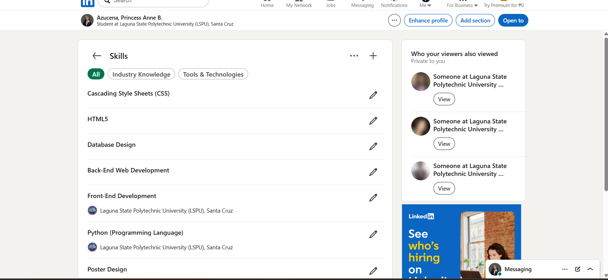

# Week 1 – Building My Professional Environment

## Student Information
* Name: PRINCESS ANNE B. AZUCENA
* Course: Bachelor of Science in Information Technology (BSIT)
* Section: 4A
* Date: August 6, 2026

---

# Objectives
1. Configure a complete local development environment by installing essential tools including VS Code, Git, GitHub Desktop, and Oracle VM VirtualBox.
2. Set up virtualized environments using Windows 11 Enterprise Evaluation and Ubuntu Desktop 26.04 ISO images for system administration practices.
3. Establish professional online presence and version control workflows using GitHub and LinkedIn platforms.
4. Document the installation procedures, troubleshoot technical hurdles encountered during virtual machine setup, and apply Markdown syntax for academic reporting.

---

# Software Installed
* Visual Studio Code (VS Code): Source-code editor used for managing workspace files and updating repository documentation.
* Git: Distributed version control system used for tracking code changes via terminal commands.
* GitHub Desktop: Graphical user interface for executing Git repository operations (commit, push, pull).
* Oracle VM VirtualBox: Type-2 hypervisor used to create and run virtual machines.
* Ubuntu 26.04 Desktop ISO: Linux-based operating system image configured within VirtualBox.
* Windows 11 Enterprise Evaluation ISO: Microsoft desktop operating system image deployed in VirtualBox.

---

# Professional Accounts
* GitHub: https://github.com/princessazucena
* LinkedIn: www.linkedin.com/in/princess-anne-azucena-30316a368

---

# Installation Screenshots

### Git Verification

### GitHub Desktop

### Visual Studio Code

### VirtualBox Manager

### Ubuntu ISO Setup

### Windows 11 ISO Setup

### Professional Accounts

---

# Challenges Encountered

1. VirtualBox "No Bootable Medium Found" Error on Windows 11 ISO
   * Problem: During the initial launch of the Windows 11 virtual machine, the system displayed a `BdsDxe: No bootable option or device was found` error because the boot key prompt timed out before a key was pressed.
   * Solution: Used the VirtualBox Mount and Retry Boot option to remount the Windows 11 ISO file. Immediately upon starting, clicked inside the virtual machine display area and repeatedly pressed the Spacebar key to capture the "Press any key to boot from CD or DVD" prompt.

2. Display Graphics Error (`vmwgfx`) During Ubuntu Boot
   * Problem: When starting the Ubuntu 26.04 virtual machine, text errors appeared stating `vmwgfx seems to be running on an unsupported hypervisor` accompanied by a black screen.
   * Solution: Powered off the virtual machine, navigated to VM Settings > Display, changed the Graphics Controller setting to `VBoxSVGA`, enabled 3D Acceleration, and restarted the virtual machine.

3. Managing Directory Paths and Creating Subfolders on GitHub Web Interface
   * Problem: Encountered difficulty creating dedicated subfolders (`screenshots/` and `accounts/`) directly within the GitHub web repository UI because the interface lacks a right-click folder creation feature.
   * Solution: Used the filename path convention in GitHub's file creator by typing the folder name followed by a slash and a placeholder file (e.g., `screenshots/.gitkeep`), or prepared the directory structure locally in File Explorer and committed the entire folder structure via Git commands.

---

# Reflection

Setting up a local development and virtualization environment is a foundational requirement for any aspiring IT professional. Through this activity, I gained practical hands-on experience in configuring core software tools, managing version control repositories, and setting up hypervisors for multi-OS virtualization. Installing Git and Visual Studio Code emphasized the importance of maintaining structured, trackable code repositories, while configuring GitHub Desktop bridged the gap between graphical workflows and command-line version control.

Setting up virtual machines for both Ubuntu Desktop and Windows 11 provided critical insights into system virtualization. Resolving installation roadblocks—such as configuring boot device priorities, setting virtual system resources, and troubleshooting display adapter compatibility—highlighted the real-world technical challenges system administrators face when deploying isolated environments. Learning to properly organize folder hierarchies and document technical setups using Markdown further reinforced the necessity of clear, standard-compliant technical documentation.

These tools and skills form the backbone of modern System Administration. Mastering virtual machine deployment allows me to safely emulate production environments, test system configurations, and deploy cross-platform services without risking host system stability. Furthermore, proficiency in Git version control and GitHub repository management ensures that infrastructure configurations, automation scripts, and system documentation are systematically tracked, audited, and maintained.

---

# References
* Oracle VM VirtualBox Documentation: https://www.virtualbox.org/wiki/Documentation
* Ubuntu Desktop Documentation: https://help.ubuntu.com/
* Microsoft Evaluation Center (Windows 11): https://www.microsoft.com/en-us/evalcenter/
* Git Official Documentation: https://git-scm.com/doc
* GitHub Docs: https://docs.github.com/
