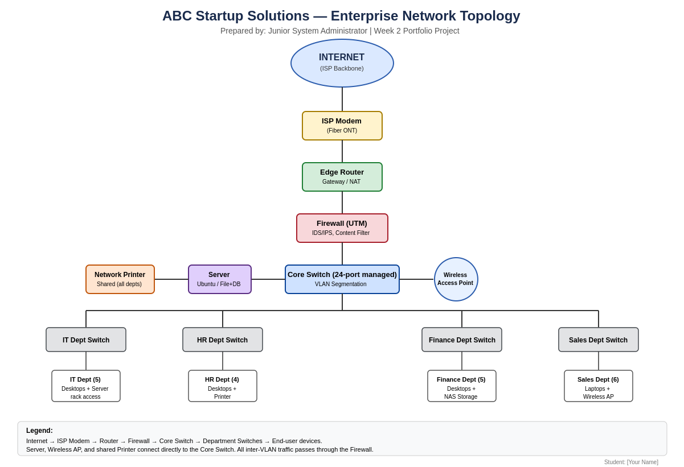

# Week 2 Portfolio Project — Enterprise Infrastructure Planning

**Course:** ITEP 414 – System Administration and Maintenance
**Program:** BS Information Technology
**Student:** [Your Name]

Project Overview
This project simulates the role of a Junior System Administrator tasked with
designing the complete IT infrastructure plan for **ABC Startup Solutions**, a
newly established 20-person software development startup with no existing
computers, servers, network, or security policies. The deliverable is a
professional infrastructure plan suitable for review by an IT Manager or
company executive.

Learning Objectives
- Explain the roles and responsibilities of a System Administrator
- Identify the hardware, software, and networking requirements of a small business
- Describe the purpose of IT documentation and infrastructure planning
- Analyze organizational IT requirements and prepare professional IT inventories
- Design an enterprise network topology and document it using Markdown

Company Scenario
ABC Startup Solutions has 20 employees across four departments:

| Department | Employees |
|---|---|
| Information Technology | 5 |
| Human Resources | 4 |
| Finance | 5 |
| Sales | 6 |
| **Total** | **20** |

The company starts from zero infrastructure — no computers, server, network,
internet, or security policies — so this project designs everything from scratch.

Hardware Inventory Summary
**12 desktop computers + 8 laptops** (20 endpoints total, one per employee), 1
rack server, 1 router, 2 switches, 4 shared printers, 2 wireless access
points, 1 NAS, UPS units at the server rack and per department, and 2
external backup drives. Full detail and justification is in
[`EnterpriseInfrastructurePlan.pdf`](./EnterpriseInfrastructurePlan.pdf).

Software Inventory Summary
Windows 11 Pro and Ubuntu Server as base operating systems, Microsoft 365 for
productivity, VS Code / Git / GitHub Desktop / VirtualBox for the development
team, Google Chrome, Microsoft Defender for Business for endpoint security,
AnyDesk for remote support, and 7-Zip for archiving. Full licensing and
justification is in the main report.

Embedded Network Diagram


Internet → ISP Modem → Router → Firewall → Core Switch → Department Switches
(IT / HR / Finance / Sales) → End-user devices, with the Server, Wireless AP,
and shared Printer connected directly to the core switch.

Technologies Used
- **Draw.io** – network topology diagram
- **Markdown** – technical documentation (this README)
- **Microsoft Word / PDF** – formal infrastructure plan report
- **GitHub** – version control and portfolio hosting

Challenges Encountered
Keeping the hardware inventory, network inventory, and network diagram fully
consistent with each other was the most difficult part — every quantity and
connection in the diagram had to trace back to a justified line item in the
tables.

Reflection
See **Part 8 — Personal Reflection** in
[`EnterpriseInfrastructurePlan.pdf`](./EnterpriseInfrastructurePlan.pdf) for
the full 300–500 word reflection on what was learned, the most challenging
task, why planning precedes deployment, and how this project builds toward a
System Administrator career.

References
- CompTIA. *A+, Network+, and Linux+ Certification Overviews.* https://www.comptia.org
- Cisco. *CCNA Certification Overview.* https://www.cisco.com/certifications
- NIST. *Special Publication 800-63B: Digital Identity Guidelines (Password Policy).* https://pages.nist.gov/800-63-3/sp800-63b.html
- Microsoft Learn. *Microsoft 365 Business Premium and Defender for Business documentation.* https://learn.microsoft.com

## 📂 Repository Structure
```
BSIT-SystemAdministration-Portfolio/
└── Week02/
    ├── EnterpriseInfrastructurePlan.pdf
    ├── README.md
    ├── diagrams/
    │   └── network_diagram.png
    ├── images/
    └── references/
```
